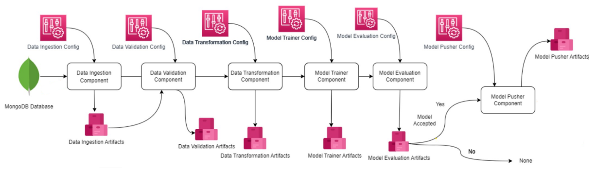
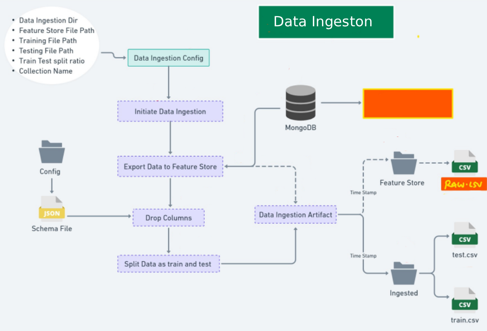
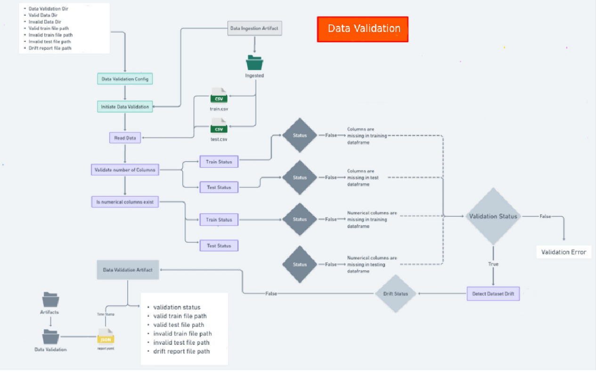
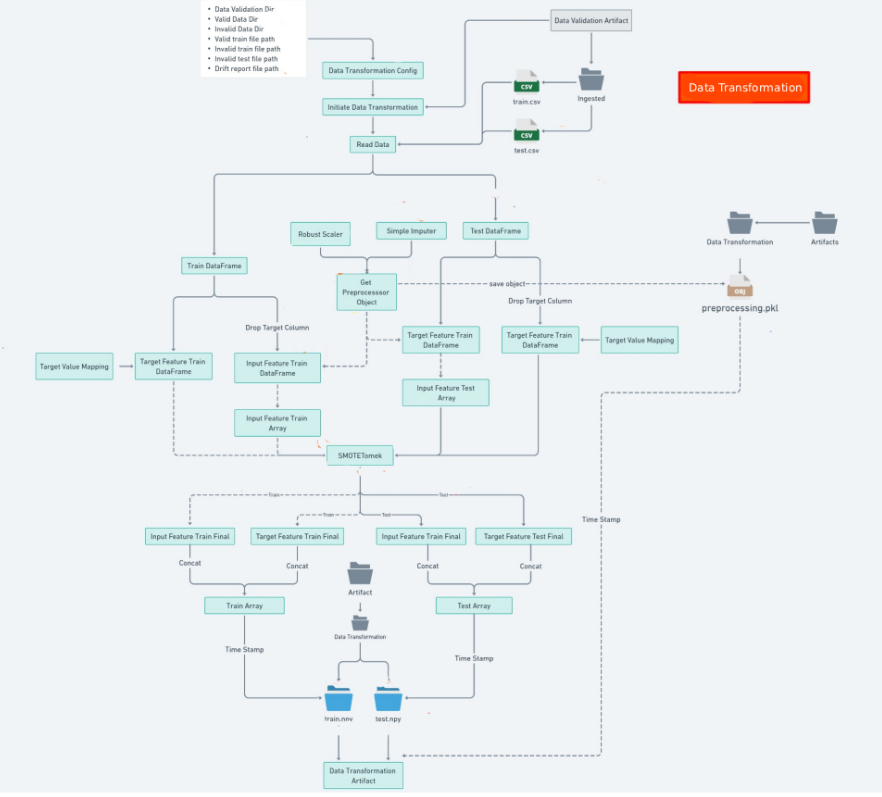
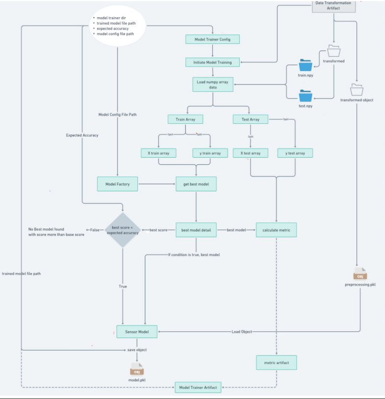

# 🛡️ Network Security ML MLOps Project

## 📘 Project Overview
This project is a **Phishing URL Detection System** developed using **Python** and deployed following **MLOps principles**.  
The goal is to classify URLs as *phishing* or *legitimate* through a fully automated pipeline covering **ETL, validation, transformation, model training, tracking, and deployment**.

### 🔑 Key Highlights
- Automated **data ingestion**, **validation**, and **transformation**
- **Model training** using multiple ML algorithms
- **Experiment tracking** via **MLflow** integrated with **DagsHub**
- **AWS S3** for artifact and model storage
- **CI/CD pipeline** using **GitHub Actions**
- **Containerized deployment** with **Docker**
- **Deployed to AWS ECS**, and **run on EC2 instance** for scalable serving
- **FastAPI**-based REST API for prediction

---

## ⚙️ Tech Stack
- **Languages & Libraries**: Python 3.10+, pandas, numpy, scikit-learn, mlflow, fastapi, uvicorn  
- **Database**: MongoDB Atlas (as ETL data source)  
- **Cloud & Deployment**: AWS S3, ECS, EC2  
- **MLOps Tools**: MLflow, DagsHub  
- **Automation**: Docker, GitHub Actions  

---

## 🧩 Project Architecture

Below are visual representations of the end-to-end workflow:

### 🗂️ Overall Project Structure


### 🧠 Data Ingestion


### ✅ Data Validation


### 🔄 Data Transformation


### 🤖 Model Trainer



---

## 📦 Python Dependencies
```text
python-dotenv
pandas
numpy
pymongo
certifi
pymongo[srv]
scikit-learn
mlflow
pyaml
dagshub
fastapi
uvicorn
python-multipart
